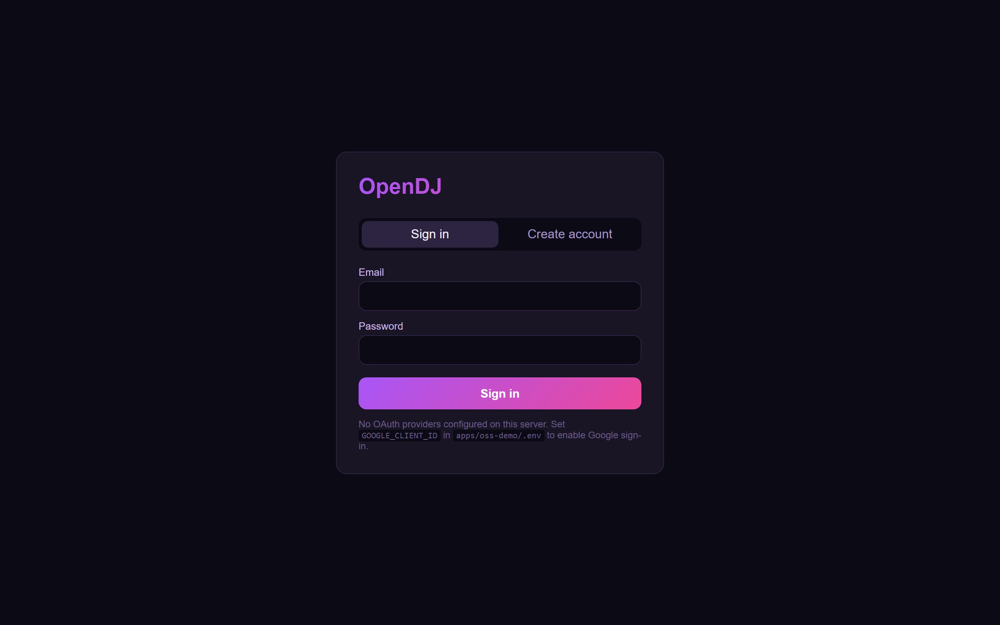
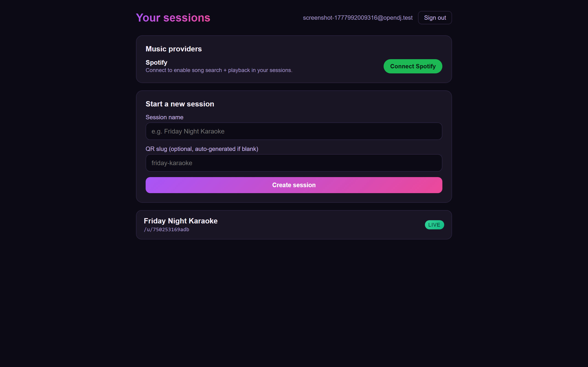
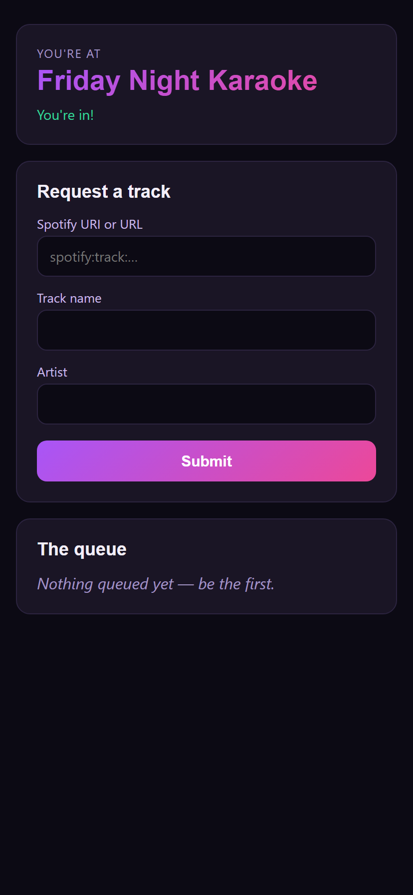

# OpenDJ

[](https://github.com/viscoci/opendj/actions/workflows/ci.yml)
[](./LICENSE)
[](./.nvmrc)
[](https://pnpm.io)
[](https://www.conventionalcommits.org)
[](./CODE_OF_CONDUCT.md)
[](./CONTRIBUTING.md)

> Collaborative, multi-provider music queue management for live events.
> Guests scan a QR code to request songs; hosts moderate the queue from a dashboard.

OpenDJ is the **public OSS foundation** for a collaborative music queue product. It provides reusable packages — provider abstractions, realtime room contracts, queue logic, lyrics/karaoke primitives, an Angular template — that you can self-host or build on top of.

A working hosted implementation lives at [opendj.live](https://opendj.live), built on these libraries. **The hosted product is a separate, private repository** ([`opendj-live`](https://github.com/viscoci/opendj-live)) — not the same source code with private files removed.

## What's working

End-to-end demo via `docker compose up`:

- 🎟️ **Guest journey** — scan QR → land on `/u/:slug` → fingerprint-based identity → request songs (3-per-guest cap, configurable)
- 🎛️ **Host journey** — register / log in (email + password or Google OAuth) → personal account auto-bootstrapped → create session → moderate the queue (approve / reject pending) → end session
- 🎵 **Spotify provider** — OAuth connect from the host dashboard, search proxied through `/api/v1/sessions/:id/search`
- 🔌 **Realtime** — WebSocket room per session, in-process registry on Node, swappable backend
- 📧 **Account flows** — email verification + password reset (both single-use, SHA-256-hashed token storage)
- 🛡️ **Auth model** — `__Host-` prefixed cookies for hosts, opaque bearer tokens for guest slots, capability-based claims (`session:create`, `queue:moderate`, etc.) checked per-request

> **Status:** every package has a real implementation, `pnpm turbo run typecheck test` is green across the workspace (~600 tests), and `apps/oss-demo` boots end-to-end behind a single port. The first migration is generated and applied automatically on container start.

## Quickstart (self-host)

```bash
git clone https://github.com/viscoci/opendj.git
cd opendj
pnpm install
pnpm turbo run lint typecheck test    # ~7s, all green
```

### Run the demo locally

```bash
cp apps/oss-demo/.env.example apps/oss-demo/.env
# Edit .env — fill SPOTIFY_CLIENT_ID + SPOTIFY_CLIENT_SECRET if you want
# the search proxy to work. Without them everything else still runs.

cd apps/oss-demo
docker compose up --build
# → http://127.0.0.1:8888
#   GET /              → Angular frontend (guest landing)
#   GET /host/login    → host login / register
#   GET /api/v1/health → { ok: true }
```

> **Always use `http://127.0.0.1:8888`, not `localhost`.** Spotify's OAuth dropped `localhost` from accepted redirect URIs in 2024 ([docs](https://developer.spotify.com/documentation/web-api/concepts/redirect_uri)), and cookies are origin-scoped — if you log in at `localhost` then Spotify bounces you back to `127.0.0.1`, you lose your session. Pick one origin and stick with it.

The container runs Drizzle migrations against the bundled Postgres on startup, so the first boot self-bootstraps the schema.

### Use the demo

1. Open http://127.0.0.1:8888/host/register and create a host account
2. From the dashboard, click **Connect Spotify** (requires Spotify creds in `.env`)
3. Click **Create session** — you get a `qrSlug`
4. Open `http://127.0.0.1:8888/u/<qrSlug>` in another browser / mobile to play guest
5. Search + request a song; back on the host page, approve it from the queue

### Screenshots

| Host login                                                                                    | Host dashboard                                                                                                                    | Guest request                                                                                                                   |
| --------------------------------------------------------------------------------------------- | --------------------------------------------------------------------------------------------------------------------------------- | ------------------------------------------------------------------------------------------------------------------------------- |
|  |  |  |

> Generated by `pnpm screenshots` — runs Playwright headlessly against the live `:8888` stack and writes PNGs to `docs/screenshots/`. Re-run any time the UI changes.

## Repo layout

```
packages/
  core/              Pure TS domain logic, provider contracts, queue rules
  db/                Drizzle schema + migrations + on-boot migrator
  auth/              OSS identity, OAuth/OIDC, password fallback, sessions, claims
  backend/           Hono routes/services usable from Node + Workers
  realtime/          Runtime-neutral realtime room contracts + events
  abuse/             Abuse signals, risk scoring, rate-limit contracts
  sync/              Song timing/synchronization primitives
  lyrics/            Lyrics lookup, LRC parsing, LRCLIB adapter
  frontend/          Reusable Angular components + typed OpenDjClient
  frontend-template/ Angular 21 OSS frontend (Capacitor-ready, web-first)
  app-shell/         Browser/Capacitor platform adapter interfaces
  agent-tools/       Dev-only MCP server (P2 reservation)
apps/
  oss-demo/          Reference self-host: Node + Postgres via Docker Compose
examples/            Minimal usage examples
docs/                Architecture, providers, repo boundary, agent guide
```

See [`docs/agent-brief.md`](./docs/agent-brief.md) for the full architectural specification and [`ROADMAP.md`](./ROADMAP.md) for what's done vs what's next.

## Tech stack

- **TypeScript strict** everywhere — no exceptions
- **Hono** server framework (Node + Cloudflare Workers compatible)
- **Drizzle ORM + Postgres** (Postgres.js adapter; Workers + Node)
- **Angular 21** for the OSS frontend template (standalone components, signals, zoneless change detection)
- **Capacitor-ready** but web-first; native shells live in `opendj-live`
- **Argon2id** password hashing
- **Vitest** for unit tests
- **Turborepo + pnpm workspaces**
- **Changesets** for versioning and changelogs
- Realtime: in-process room registry for OSS (optional Valkey scale-out); Cloudflare Durable Objects for hosted

## Contributing

Contributions welcome. Read [`CONTRIBUTING.md`](./CONTRIBUTING.md) first — it covers dev setup, Conventional Commits, DCO sign-off, Changesets, and what does (and doesn't) belong in this repo.

By participating you agree to the [Code of Conduct](./CODE_OF_CONDUCT.md).

## Community

- 💬 [Discussions](https://github.com/viscoci/opendj/discussions) — questions, ideas, show & tell
- 🐛 [Issues](https://github.com/viscoci/opendj/issues) — bugs and feature requests
- 🔒 [Security](./SECURITY.md) — report vulnerabilities privately
- 📜 [Code of Conduct](./CODE_OF_CONDUCT.md)

## License

MIT — see [`LICENSE`](./LICENSE).
